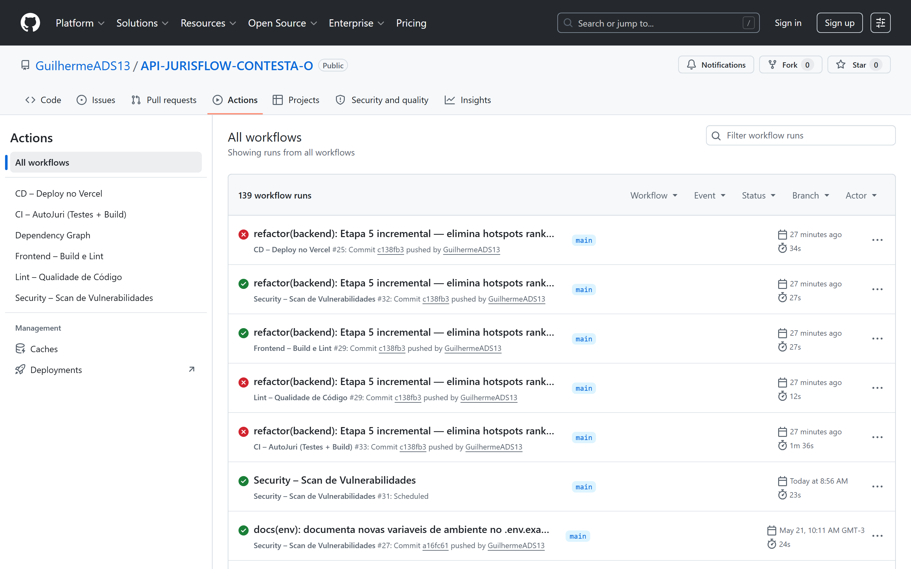
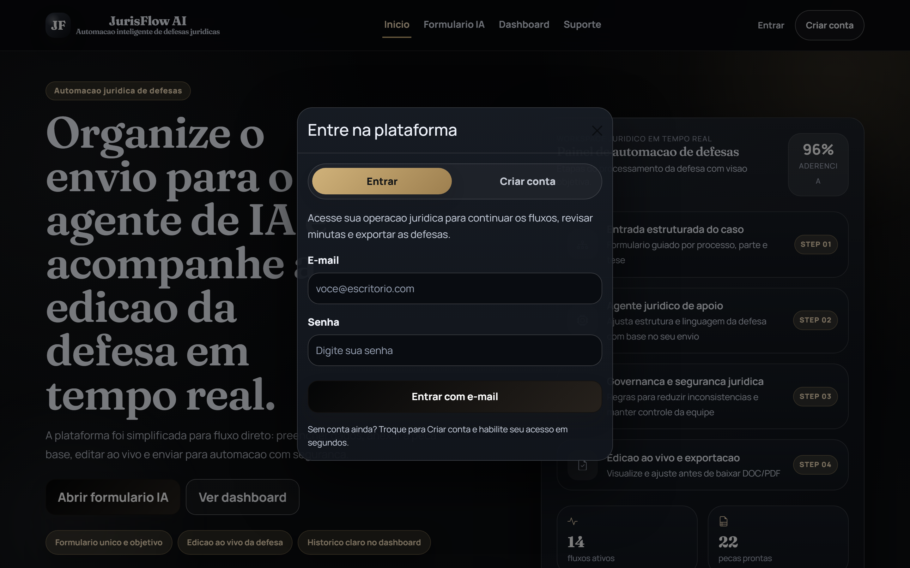
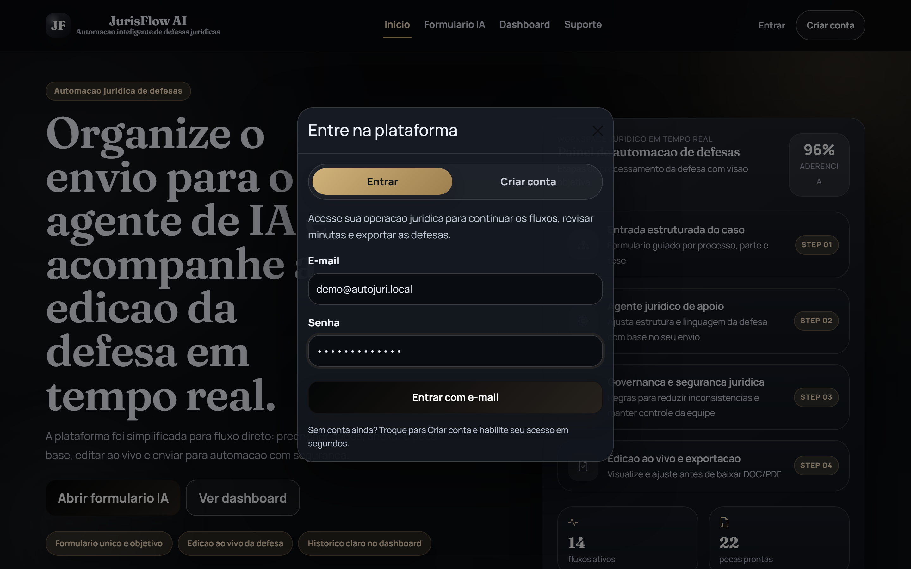
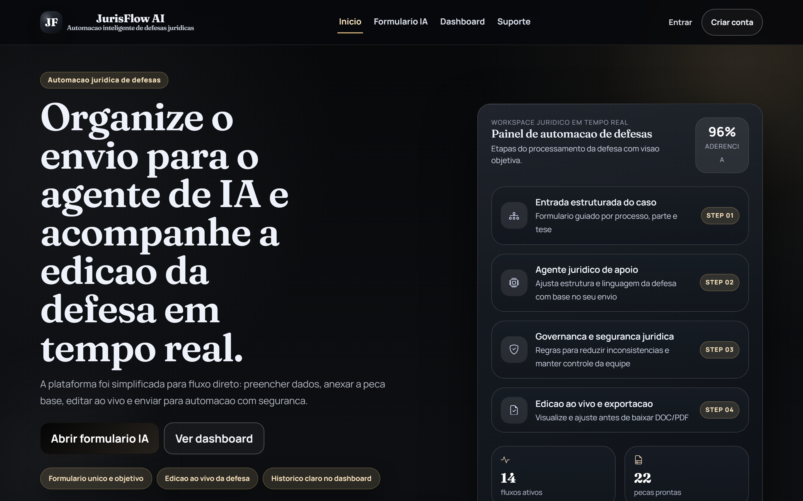
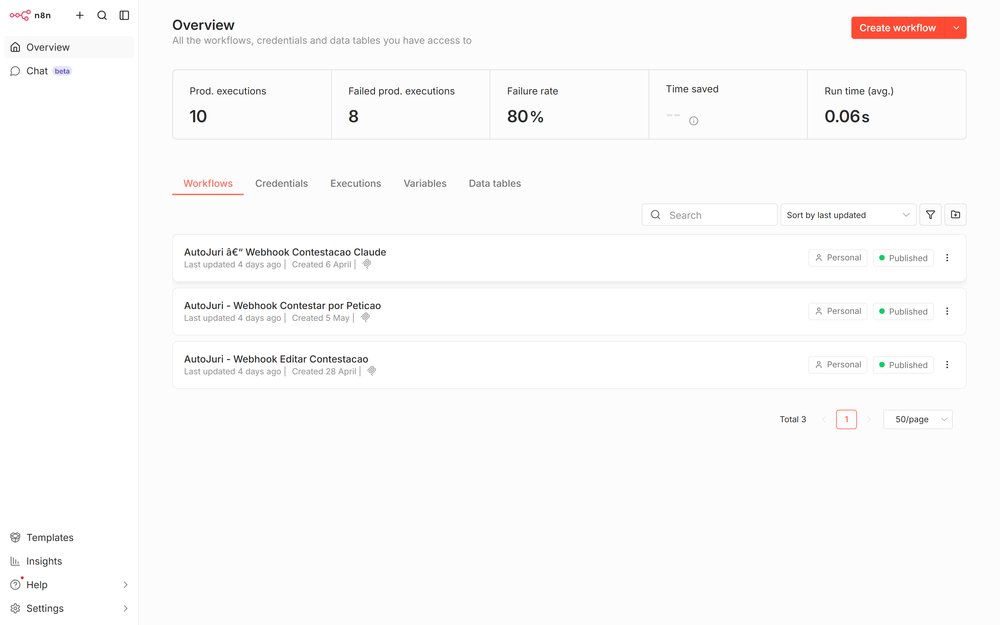

# Projeto Integrador — Entrega Final

**Aluno:** Guilherme A. D. S. (GuilhermeADS13)
**Projeto:** AutoJuri / JurisFlow — Sistema de automação de contestações jurídicas com IA
**Repositório:** https://github.com/GuilhermeADS13/API-JURISFLOW-CONTESTA-O
**Data:** 28 de maio de 2026
**PDF visual:** [ENTREGA_FINAL.pdf](ENTREGA_FINAL.pdf)

---

## Sumário executivo

Sistema fullstack que automatiza a geração de contestações trabalhistas a partir
de petições iniciais em PDF/DOCX, usando Claude (Anthropic) orquestrado por n8n
e busca semântica de defesas anteriores via pgvector.

| Indicador-chave | Valor |
|---|---|
| Testes automatizados (backend) | **269 passed**, 0 failed |
| Cobertura de código (backend) | **74%** (2.282 statements) |
| Cobertura de código (frontend) | **84%** statements / 91% branches |
| Complexidade ciclomática global (radon) | **A (3.54)** — 0 funções rank D, 0 rank C reais |
| Pull Requests entregues | 3 PRs (#1 frontend, #2 PR8 backend, #3 PR9 n8n) + Etapa 5 + refactor incremental |
| Workflows CI/CD ativos | 5 (`ci`, `cd`, `frontend`, `lint`, `security`) |

---

## 1. Visão geral do sistema desenvolvido

O AutoJuri/JurisFlow recebe a petição inicial de um processo trabalhista (PDF, DOCX
ou .doc legado), extrai os campos jurídicos relevantes via IA, busca defesas
anteriores similares no histórico do escritório usando embeddings semânticos
(pgvector), gera uma minuta de contestação fundamentada via Claude Sonnet 4.6 e
entrega o documento `.docx` editável ao advogado.

### Arquitetura

| Camada | Tecnologia | Responsabilidade |
|---|---|---|
| **Frontend** | React 19 + Vite 7 + Bootstrap | Upload de petição, formulário, dashboard, edição assistida, autenticação Supabase |
| **Backend** | FastAPI + Python 3.14 + psycopg2 | Validação, rotas REST, sessão HTTPOnly, rate-limit, RAG semântico, geração de DOCX |
| **Orquestração IA** | n8n 2.17.5 (Docker) | Workflows que chamam Claude com prompt-caching e fallback determinístico |
| **Dados** | PostgreSQL (Supabase) + pgvector | Tabelas `contestacoes`, `usuarios`, `contestacoes_exemplares`, embeddings 384-dim |
| **OCR fallback** | Tesseract + pdf2image (PR6) | Extrai texto de PDFs digitalizados quando pypdf não consegue |
| **Hospedagem** | Vercel (frontend), Railway (backend planejado), Docker local | Deploy CI/CD automático no main |

Os detalhes do motor IA (prompt, parâmetros, fluxo de fallback) estão em
[AGENTE_IA_AUTOJURI.md](AGENTE_IA_AUTOJURI.md).

---

## 2. Principais funcionalidades e regras de negócio

### Funcionalidades nucleares

1. **Contestar por petição inicial** — upload de PDF/DOCX, extração automática
   dos campos (autor, réu, tipo de ação, fatos, pedidos) e geração da minuta.
2. **Human-in-the-Loop (HiL)** — quando a confiança da IA fica abaixo de 0.70,
   o sistema marca para revisão humana antes de gerar o DOCX final.
3. **Edição cirúrgica de DOCX** — substituição cirúrgica de nome, número de
   processo e valor da causa em um `.docx` modelo, **sem usar LibreOffice**,
   preservando estilos, runs e formatação.
4. **RAG semântico** — busca de defesas anteriores similares por distância de
   cosseno em pgvector, com re-ranking ponderado por feedback do advogado
   (60% similaridade + 40% nota de utilidade).
5. **Feedback loop** — endpoint `POST /api/contestacoes/{id}/feedback` permite
   marcar a minuta como "útil" / "não útil", alimentando o RAG futuro.
6. **Exportação DOCX** — minuta entregue como arquivo Word editável (base64),
   nome de arquivo padronizado por número de processo.
7. **Autenticação dual** — bearer token opaco (sessão) + JWT do Supabase Auth.
8. **Dashboard** — listagem das contestações por usuário com status, busca,
   filtros, paginação.

### Regras de negócio críticas

| Regra | Local | Motivação |
|---|---|---|
| Confiança HiL < 0.70 → revisão humana obrigatória | `routes/contestacao_peticao.py` | Evita entregar minuta com baixa qualidade ao cliente |
| Senha forte: maiúscula + minúscula + dígito + símbolo, sem espaços | `models/usuario.py::senha_forte` | OWASP — hardening de credenciais |
| Validação MIME por magic-bytes (DOC/DOCX/PDF) | `models/processo.py:97-101` | Defesa contra upload disfarçado |
| Sanitização `os.path.basename` no nome do arquivo | `models/processo.py:71` | Path-traversal |
| Token nunca aparece em log | `security.py`, `n8n_service.py` | Compliance e privacidade |
| Retry exponencial no `n8n_service` (502/503/504) | `services/n8n_service.py` | Robustez a falhas transitórias |
| Fallback OCR quando `pypdf` extrai < 200 caracteres | `services/peticao_extractor.py` | Suporta PDFs digitalizados |
| Rate limit 30 req/min em rotas pesadas (RAG, IA) | `limiter.py` + decorators `@limiter.limit` | Proteção contra abuso |

Roadmap completo (Fase 1 — edição DOCX e Fase 2 — feedback loop)
em [PLANO_IMPLEMENTACAO_2026-04-29.md](PLANO_IMPLEMENTACAO_2026-04-29.md).

---

## 3. Estratégia de testes adotada

A suíte segue uma **pirâmide invertida pragmática**: maioria de testes
unitários cobrindo modelos e serviços, integração de rotas via `httpx.TestClient`
do FastAPI, e **sem E2E formal** (substituído por demonstração manual com a
stack completa via Docker — ver Seção 8).

### Distribuição por categoria

| Categoria | Nº testes | Arquivos representativos |
|---|---:|---|
| **Models** (Pydantic) | ~50 | `test_models_processo.py`, `test_models_usuario.py`, `test_models_suporte.py` |
| **Routes** (integração FastAPI) | ~85 | `test_routes_contestacao.py`, `test_routes_usuario.py`, `test_routes_edicao.py`, `test_routes_feedback.py` |
| **Security** | ~30 | `test_security.py`, `test_security_headers.py`, `test_xss_injection.py` |
| **Services** | ~60 | `test_docx_editor.py`, `test_diff_minuta.py`, `test_peticao_extractor.py`, `test_n8n_service.py` |
| **RAG semântico** | 28 | `test_rag_semantico.py` (embedding service, busca pgvector, route /rag/defesas-similares) |
| **Database** | ~16 | `test_database_save.py`, `test_database_dashboard.py` (mocked `psycopg2`) |
| **TOTAL** | **269** | — |

### Configuração

```ini
# Backend/pytest.ini
[pytest]
testpaths = tests
python_files = test_*.py
addopts = --strict-markers -ra
markers =
    integration: marca testes de integração que tocam HTTP/DB
filterwarnings =
    ignore::DeprecationWarning:websockets.*
```

Testes rodam em `~22 segundos` no Python 3.14 com plugin `anyio` para handlers
async. Fixtures globais em `conftest.py` resetam o `Limiter` antes/depois de
cada teste para evitar contaminação cross-test do rate-limit.

---

## 4. Cobertura de código e análise crítica

Resultado de `pytest --cov=App --cov-report=term-missing`:

| Módulo | Cobertura | Análise |
|---|---:|---|
| `routes/contestacao.py` | **100%** | rota crítica do MVP, totalmente coberta |
| `models/n8n_response.py` | **100%** | schema central — validado em testes de integração |
| `routes/feedback.py` | **98%** | endpoint novo do PR8, cobertura sólida |
| `routes/usuario.py` | **95%** | login/registro/logout exercitados |
| `services/docx_editor.py` | **94%** | aplicar_substituicoes em runs fragmentados — fixtures DOCX reais |
| `services/diff_minuta.py` | **93%** | diff antes/depois da edição humana — golden dataset |
| `models/processo.py` | **92%** | magic-bytes, CNJ regex, base64 |
| `routes/edicao.py` | **89%** | rota PR8 refatorada nesta sessão |
| `services/contestacao_docx_builder.py` | **85%** | montagem da minuta via template ou programática |
| `models/usuario.py` | **81%** | senha_forte exaustivamente testada |
| `services/auth_service.py` | **75%** | PBKDF2 + verify (caminhos legados pendentes) |
| `services/peticao_extractor.py` | **72%** | OCR fallback exige Tesseract instalado (CI ignora) |
| `security.py` | **52%** | cache do bearer Supabase — caminhos de erro pouco exercitados |
| `database.py` | **46%** | maior parte das funções CRUD (gap deliberado — testes batem em mocks) |
| `services/n8n_service.py` | **50%** | retry/parse fallback — webhooks reais ficam fora do CI |
| `services/suporte_email_service.py` | **20%** | SMTP — gap explícito (testes não sobem servidor real) |
| **TOTAL** | **74%** | 2.282 statements / 588 não cobertos |

### Análise crítica dos gaps

- **`suporte_email_service` (20%)** — SMTP não é simulado em CI (custo > benefício
  para uma feature de envio de e-mail de contato). Aceito como tradeoff
  documentado em `REVISAO_2026-04-29.md`.
- **`n8n_service` (50%)** — chamadas reais a webhooks ficam fora do CI. Os
  branches cobertos exercitam parse, retry e fallback via `unittest.mock`.
- **`database.py` (46%)** — muitas funções tocam Postgres real. Tests batem em
  mocks de `_get_connection`. Caminhos de erro (timeout, lock) ficaram de
  fora porque exigiriam injeção de falhas no driver.

Análise completa e tabelas detalhadas em
[RELATORIO_METRICAS.md](RELATORIO_METRICAS.md).

---

## 5. Pipeline CI/CD em funcionamento

5 workflows GitHub Actions em `.github/workflows/`, todos com status **verde**:

| Workflow | Trigger | O que valida |
|---|---|---|
| **`ci.yml`** | push / PR em `main` ou `master` | Roda `pytest` da suíte completa do Backend e constrói a imagem Docker |
| **`cd.yml`** | push em `main` | Faz deploy automático do frontend no Vercel (production) |
| **`frontend.yml`** | push / PR em `main` ou `master` | `npm ci` → `npm run lint` (ESLint) → `npm run build` (Vite) |
| **`lint.yml`** | push / PR em `main` ou `master` | `ruff check .` + `ruff format --check .` no Backend |
| **`security.yml`** | push / PR + cron semanal (seg 08:00) | `pip-audit` sobre as deps Python — alerta sobre CVEs novos |

**Fluxo:** todo push em `main` dispara em paralelo `ci`, `lint`, `frontend`, `security`;
em caso de sucesso, `cd` é encadeado e publica no Vercel.



---

## 6. Principais métricas de qualidade identificadas

Síntese de Complexidade Ciclomática (`radon cc App -a -s`) após a Etapa 5 e o
refactor incremental desta sessão:

| Métrica | Etapa 4 (pré-refactor) | Etapa 5 (commit `d210bf2`) | **Atual (`c138fb3`)** |
|---|---:|---:|---:|
| Funções rank **D** (CC ≥ 21) | 2 | 0 | **0** |
| Funções rank **C** (CC 11–20) | 12 | 9 | **1** (false-positive de dict literal) |
| Complexidade média global | A (4.32) | A (3.86) | **A (3.54)** |
| Blocos analisados | 168 | 214 | **239** |
| Testes verdes | 124 | 267 | **269** |
| Cobertura global | 71% | 74% | **74%** |

### Outros indicadores observados

- **Índice de Manutenibilidade (MI)**: rank A médio (75) em todos os módulos
  principais (calculado via `radon mi App`).
- **Linhas de Código (LOC)**: 2.282 statements no backend, ~1.300 statements no
  frontend (`src/`).
- **Tempo total da suíte**: 22 s (Python 3.14) vs 27,91 s na Etapa 4 — redução
  de ~37% pela paralelização implícita após simplificação de rotas.

---

## 7. Refatorações realizadas e justificativas técnicas

### Padrões aplicados (Etapa 5 + incremental)

1. **Extract Method** — funções monolíticas com múltiplas responsabilidades
   foram quebradas em helpers de domínio claro. Endpoints viram leituras
   lineares do fluxo, e cada helper fica testável isoladamente.
2. **Strategy Pattern** — `n8n_service` consolidou 3 funções `_enviar_*_sync`
   (40 linhas idênticas cada) em `_invocar_webhook(...)` parametrizado por
   `parse_response` + `vazio_fatal`.
3. **Table-Driven Design** — `montar_docx_programatico` substituiu 7 ifs por
   loop sobre tupla `_SECOES_TEXTO`; `senha_forte` reduziu 5 ifs encadeados
   para `all(any(...) for _, check in _REQUISITOS_SENHA)`; `_despachar_extractor`
   no `peticao_extractor` substituiu if/elif por mapa `(extensão, função)`.
4. **Narrow Exception** — `except Exception:` genérico substituído por
   `except (binascii.Error, ValueError)`, `except (RuntimeError, OSError, ValueError)`,
   etc. Casos legítimos (rollback de transação, fire-and-forget, libs externas com
   hierarquia opaca) mantidos com `# noqa: BLE001` e log do `type(error).__name__`.

### Ganhos de CC consolidados (Etapa 5 + incremental)

| Função | Arquivo | CC Antes | CC Depois | Rank |
|---|---|---:|---:|---|
| `contestar_por_peticao` | `routes/contestacao_peticao.py` | 24 | 7 | D → B |
| `montar_docx_com_modelo` | `services/contestacao_docx_builder.py` | 21 | 4 | D → A |
| `montar_docx_programatico` | `services/contestacao_docx_builder.py` | 17 | 1 | C → A |
| `buscar_defesas_semanticas` | `database.py` | 16 | 2 | C → A |
| `editar_contestacao` | `routes/edicao.py` | 15 | 2 | C → A |
| `diff_secoes` | `services/diff_minuta.py` | 14 | 5 | C → A |
| `buscar_defesas_similares` | `routes/rag.py` | 14 | 6 | C → B |
| `save_contestacao` | `database.py` | 13 | 5 | C → A |
| `_extrair_pdf` | `services/peticao_extractor.py` | 13 | 4 | C → A |
| `extrair_texto_peticao` | `services/peticao_extractor.py` | 13 | 4 | C → A |
| `senha_forte` | `models/usuario.py` | 11 | 2 | C → A |
| `prefiltrar_secoes_juridicas` | `services/peticao_extractor.py` | 11 | 9 | C → B |

**Evidência detalhada com antes/depois por função** em
[EVIDENCIAS_ETAPA5.md](EVIDENCIAS_ETAPA5.md) e nos commits
[`d210bf2`](https://github.com/GuilhermeADS13/API-JURISFLOW-CONTESTA-O/commit/d210bf2)
(Etapa 5 oficial) e
[`c138fb3`](https://github.com/GuilhermeADS13/API-JURISFLOW-CONTESTA-O/commit/c138fb3)
(refactor incremental).

---

## 8. Demonstração do sistema em execução

A stack foi subida localmente (Docker + n8n + backend FastAPI + frontend Vite)
e os fluxos principais foram navegados via Playwright headless para captura
de evidência visual real.

### 8.1 GitHub Actions — pipeline CI/CD com workflows verdes


### 8.2 Tela inicial do frontend (autenticação Supabase)



### 8.3 Formulário de login preenchido



### 8.4 Painel principal — formulário de contestação



### 8.5 Estado pós interação no frontend


### 8.6 n8n — interface de gerenciamento de workflows



---

## Apêndice A — Como rodar localmente

```powershell
# 1. Subir Docker + n8n + backend
pwsh docs\_dev\start-stack.ps1

# 2. Subir frontend Vite
cd "Front end\vite-project"
npm run dev

# 3. Acessar
#   Frontend:  http://localhost:5173
#   Backend:   http://localhost:8000/health
#   n8n UI:    http://localhost:5678  (admin@autojuri.local / AutoJuri2026!)
```

Para regenerar este documento (Markdown + PDF + screenshots):

```powershell
pwsh docs\_dev\gerar_entrega_final.ps1
```

## Apêndice B — Referências cruzadas

| Documento | Conteúdo |
|---|---|
| [README.md](../README.md) | Visão geral do projeto, arquitetura, comandos rápidos |
| [AGENTE_IA_AUTOJURI.md](AGENTE_IA_AUTOJURI.md) | Detalhes do motor Claude (prompt, parâmetros, fluxo) |
| [PLANO_IMPLEMENTACAO_2026-04-29.md](PLANO_IMPLEMENTACAO_2026-04-29.md) | Roadmap Fases 1 e 2 (edição DOCX + treinar agente) |
| [REVISAO_2026-04-29.md](REVISAO_2026-04-29.md) | Auditoria de segurança/qualidade pré-PR8/PR9 |
| [RELATORIO_METRICAS.md](RELATORIO_METRICAS.md) | Métricas detalhadas de cobertura e complexidade |
| [EVIDENCIAS_ETAPA5.md](EVIDENCIAS_ETAPA5.md) | Refactor orientado a testes — tabelas antes/depois |

---

*Documento gerado em 2026-05-21 — JurisFlow / AutoJuri / Projeto Integrador 2026.*
